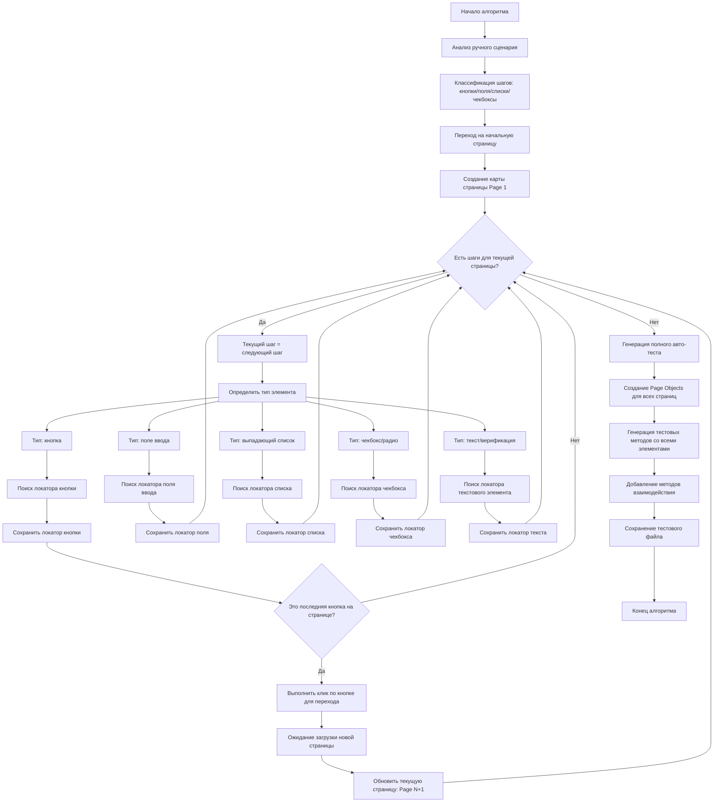

# Блок-схема алгоритма

```mermaid
graph TD
    A[Начало алгоритма] --> B[Анализ ручного сценария];
    B --> C[Классификация шагов: кнопки/поля/списки/чекбоксы];
    C --> D[Переход на начальную страницу];
    D --> E[Создание карты страницы Page 1];
    
    E --> F{Есть шаги для текущей страницы?};
    F -->|Да| G[Текущий шаг = следующий шаг];
    G --> H[Определить тип элемента];
    
    H --> I[Тип: кнопка];
    H --> J[Тип: поле ввода];
    H --> K[Тип: выпадающий список];
    H --> L[Тип: чекбокс/радио];
    H --> M[Тип: текст/верификация];
    
    I --> N[Поиск локатора кнопки];
    J --> O[Поиск локатора поля ввода];
    K --> P[Поиск локатора списка];
    L --> Q[Поиск локатора чекбокса];
    M --> R[Поиск локатора текстового элемента];
    
    N --> S[Сохранить локатор кнопки];
    O --> T[Сохранить локатор поля];
    P --> U[Сохранить локатор списка];
    Q --> V[Сохранить локатор чекбокса];
    R --> W[Сохранить локатор текста];
    
    S --> X{Это последняя кнопка на странице?};
    T --> F;
    U --> F;
    V --> F;
    W --> F;
    
    X -->|Нет| F;
    X -->|Да| Y[Выполнить клик по кнопке для перехода];
    Y --> Z[Ожидание загрузки новой страницы];
    Z --> AA[Обновить текущую страницу: Page N+1];
    AA --> F;
    
    F -->|Нет| AB[Генерация полного авто-теста];
    AB --> AC[Создание Page Objects для всех страниц];
    AC --> AD[Генерация тестовых методов со всеми элементами];
    AD --> AE[Добавление методов взаимодействия];
    AE --> AF[Сохранение тестового файла];
    AF --> AG[Конец алгоритма];
```